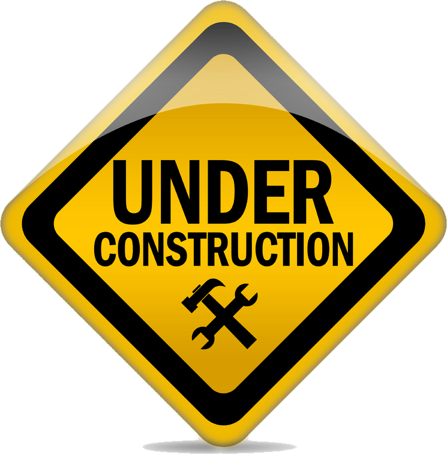

# PROYECTO PERSONAL - Mis Herramientas
## Página Web Personal con todas mis herramientas de uso diario, para utilizar de inicio en mi navegador

## Desarrollado por: Emmanuel Sierra (Mayo 2026 -Actual)

Tecnologías utilizadas:

 

 

    

